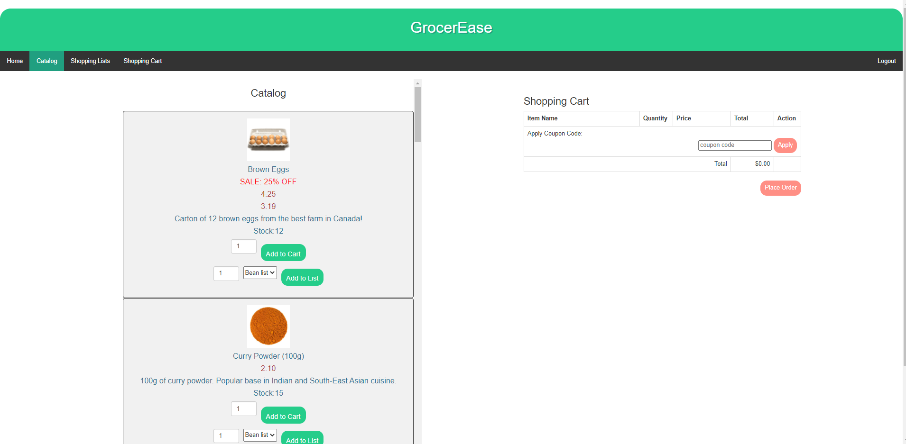
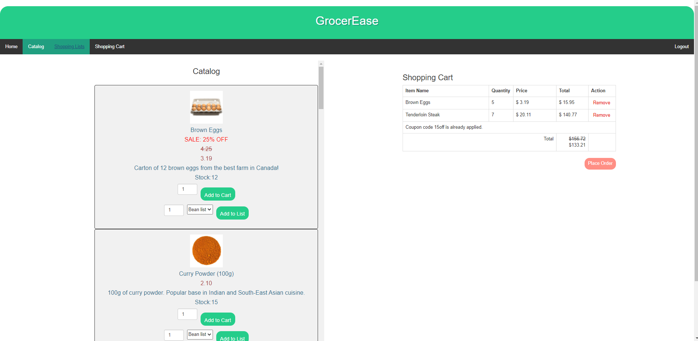
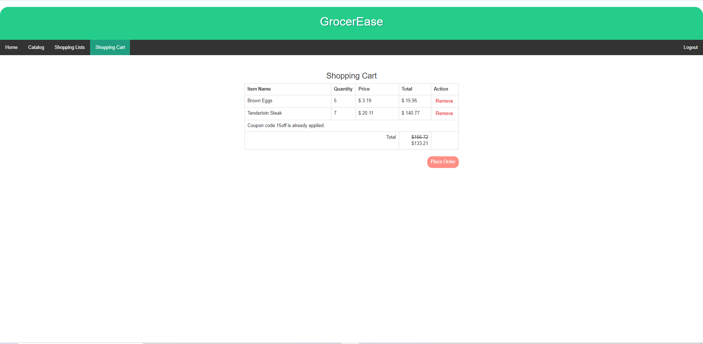
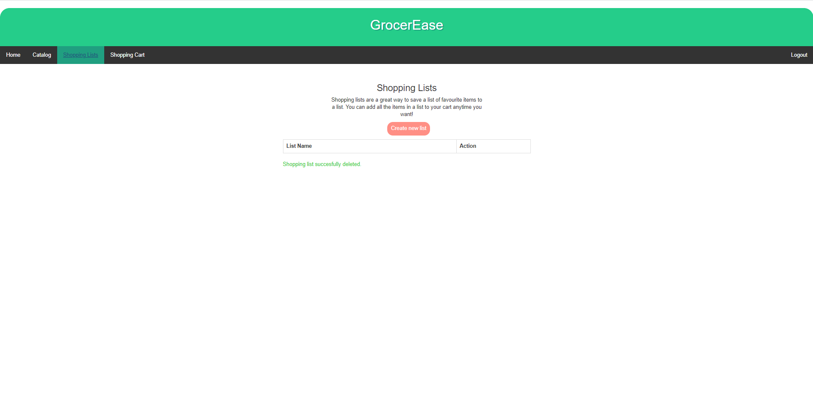
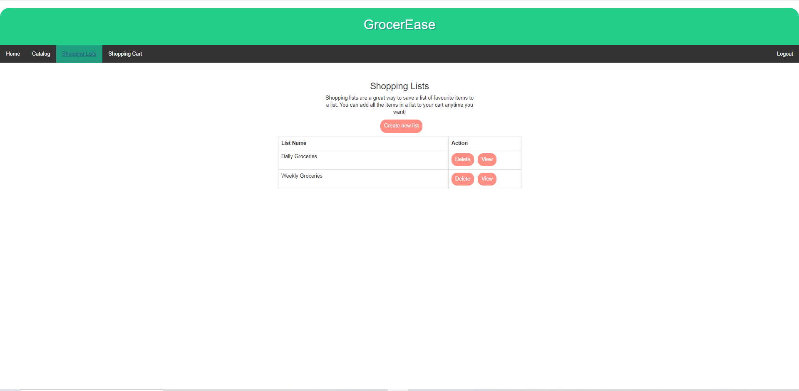
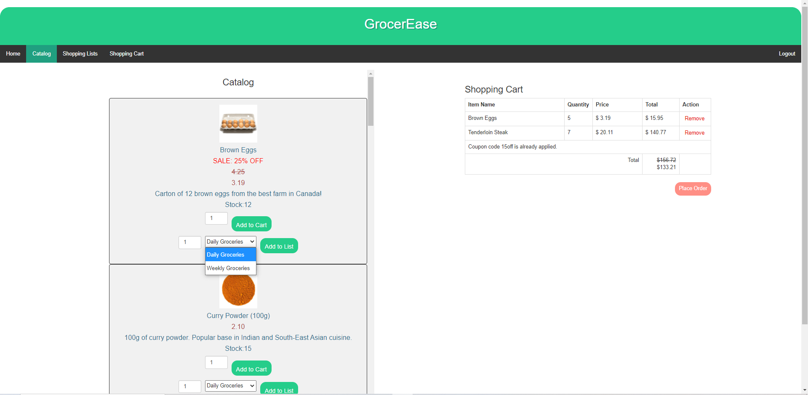
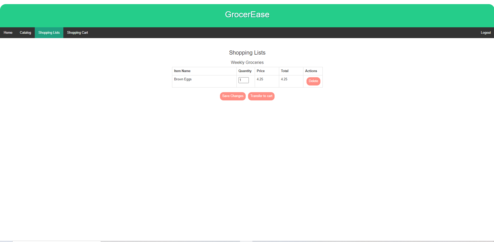
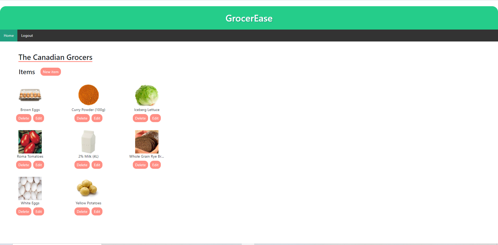
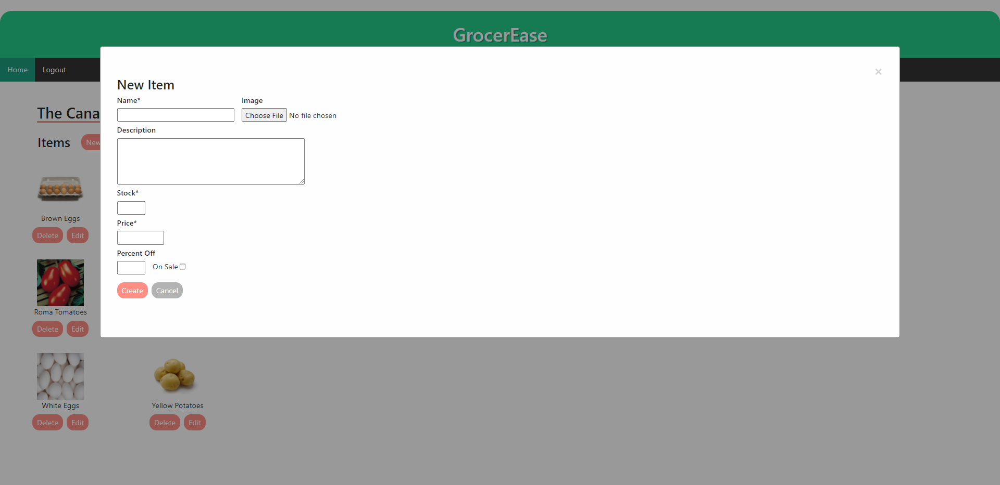
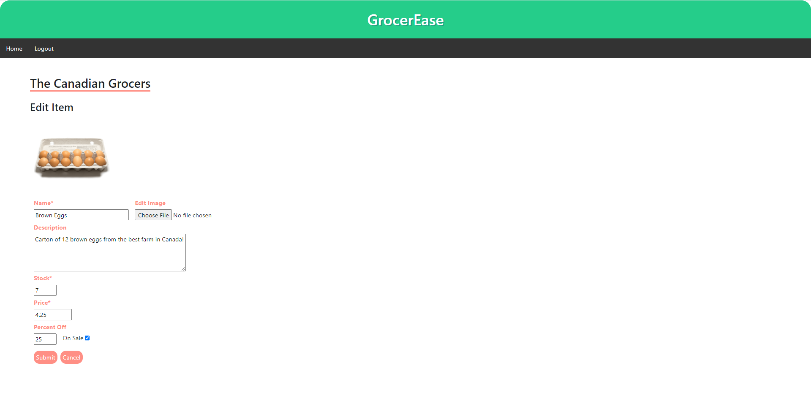

GrocerEase 
Online Grocery Store
CPSC 471 Database Management Systems Final Project

Contributors Group 14:
Garland Khuu 
Fabio Fahme
Brandon Sin

Functional online store, allows to register an account, login, add items to shopping cart and checkout or create shopping lists with items and transfer whole shopping lists to shoping cart for quick checkout of recurring purchases.
Allows user to apply coupons.

Manager account allows manager to add new products, edit and delete already existing products.

 
Main landing page

 
Login Page

 
Registration Page

 
Catalogue Page

 
Items added to cart can be shown on the right side of screen

 
Shopping Cart Page

 
Shopping List menu, can create new shopping lists or delete existing ones

 
Display of shopping lists

 
Add items to cart or to list from main catalogue

 
Items Showing in shopping list, can swiftly transfer all items in shopping list to shopping cart for quick checkout, this won't delete items from the shopping list

 
Manager Landing page

 
Manager create new item

 
Manager edit existing item
